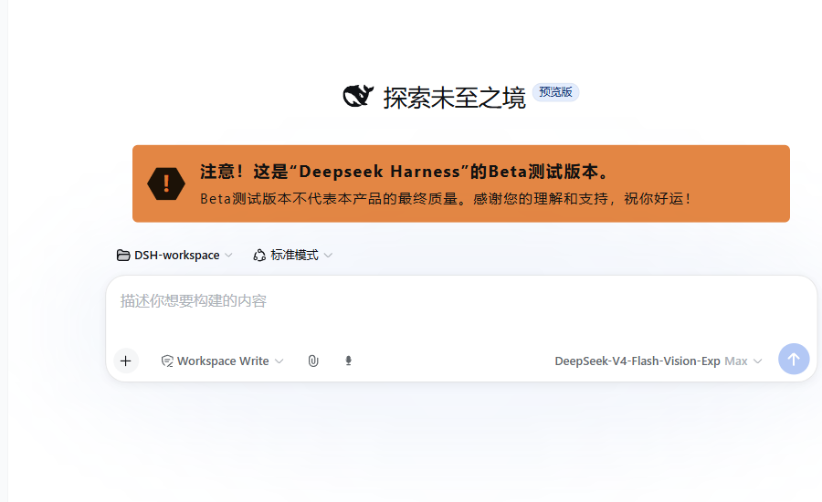
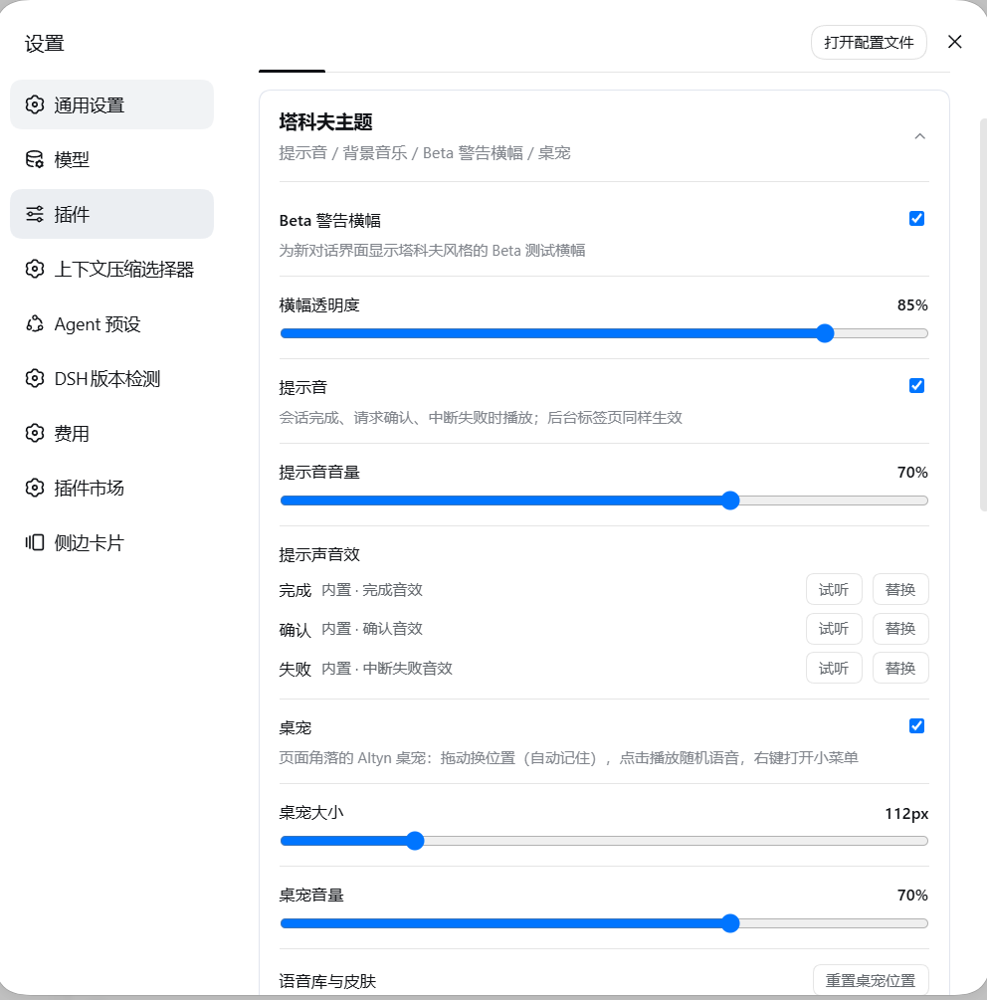
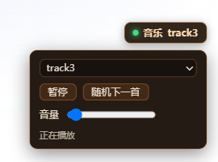
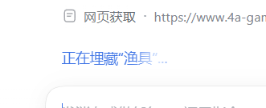

# dsh-theme-tarkov


以《逃离塔科夫》（Escape from Tarkov）主界面为灵感的 DeepSeek Harness（DSH）Web 界面主题插件：Beta 警告横幅、提示音、背景音乐、Altyn 桌宠，以及状态行文本。

> 本插件仅以游戏风格为灵感，界面元素均为 CSS / SVG / 代码实现；背景音乐默认不随包分发，由用户自行提供（见下文「文件放在哪里」）。

## 界面截图

| | |
| --- | --- |
|  | 新对话界面的 Beta 警告横幅，文案与透明度均可在设置中调整 |
|  | 设置 → 插件 → 插件配置 →「塔科夫主题」：各功能开关、音量、横幅透明度、曲目管理 |
|  | 右下角 BGM 浮窗|
|  | Altyn 桌宠，点击发出随机语音，可拖动 |
|  | 状态行随机文案 |

## 功能

- **Beta 警告横幅**：为新对话界面添加塔科夫风格的 Beta 测试横幅，文案与透明度可在设置中调整。
- **提示音**：会话完成、请求确认、中断失败时播放对应音效；后台标签页也会响；三种场景都可以换成你自己的音频。
- **背景音乐**：右下角浮窗播放器，曲库由你自己提供（目录放置或面板上传）；多个标签页同时打开时，只有 leader 标签页在播放。
- **Altyn 桌宠**：角落里的 Altyn 头盔小人——拖动换位置（自动记住）、**点击播放随机 Scav 语音**（包内 47 条）；把自备音频放进语音目录可加入随机池。
- **状态行随机文案**：运行中的「深度求索中...」换成塔科夫风台词（如「正在寻找加密 U 盘...」），**每完成一步**（一次思考、一次工具调用）随机换一句。
- **设置面板**：设置 → 插件 → 插件配置 →「塔科夫主题」，开启/关闭各功能、调整音量与横幅透明度、管理音乐曲库（添加 / 删除 / 禁用）。

## 安装

> **方式一（推荐）：npm 一键安装**

```bash
dsh plugin --profile web add dsh-theme-tarkov
```

> **方式二：git clone + link 安装**

```bash
git clone https://github.com/ZHIGENGNIAO258/dsh-theme-tarkov.git
dsh plugin --profile web add link:<绝对路径>   # 把 <绝对路径> 换成上面的克隆目录
```

`dsh plugin add` 会把本包加入 `~/.dsh/profiles/web/package.json` 的 `dsh.profile.bundles`，bundle 层**自动应用**包内 `cordis.patch.yml`（即插件行 `id: tarkov`）。重启 dsh web 即生效。

- **npm 安装**：无需保留任何目录；升级运行 `dsh plugin --profile web update dsh-theme-tarkov` 后重启 dsh web。
- **link 安装**：**请保留克隆目录不要删除**——profile 通过软链接引用它；升级只需 `git pull` 再重启 dsh web。

> 提示：包刚发布后 24 小时内安装可能被 DSH web profile 的「最低发布年龄」策略（`minimumReleaseAge: 24h`）拦截；稍等重试，或把 `dsh-theme-tarkov` 加入 profile `pnpm-workspace.yaml` 的 `minimumReleaseAgeExclude`。

## 配置：文件放在哪里

| 位置 | 内容 |
| --- | --- |
| `~/.dsh/dsh-tarkov/music/` | 背景音乐：**直接把音频文件丢进去即可**（mp3 / wav / ogg / m4a / aac / flac），或在设置面板点「添加音乐」上传（上限 200MB） |
| `~/.dsh/dsh-tarkov/sounds/` | 提示音：内置音效（done.m4a / approval.m4a / error.m4a）由插件直接伺服，**不需要复制**；想换音效就放一个同名文件（任意音频格式）到这里，或用设置面板上传 |
| `~/.dsh/dsh-tarkov/voice/` | 桌宠随机语音：**把音频文件丢进去即可**（mp3 / wav / ogg / m4a / aac / flac），与包内语音一起进随机池；包内无语音时不放文件也能玩 |
| `assets/pet/voice/`（包内） | **内置 361 条 Scav 语音**（mp3，44.1kHz 单声道 CBR 64kbps、合计约 5.4MB，随 npm 包分发 |
| `assets/status/texts.zh.txt`（包内） | **状态行随机文案池**（中文）：一行一句，`#` 开头的行与空行忽略，重复行只取第一条；每完成一步随机换一句。`texts.en.txt` 是英文池，缺失时英文界面回落到中文池。改完刷新页面即可，无需重启 |
| `~/.dsh/dsh-tarkov/pet/` | 桌宠自定义皮肤：放一张 `pet.png`（也可 gif / webp / jpg）覆盖默认的 Altyn 小人。 |
| `~/.dsh/dsh-tarkov/prefs.json` | 全部设置（音量、透明度、开关、禁用曲目等） |

安装后打开设置 → 插件 → 插件配置 →「塔科夫主题」，即可开启/关闭各功能、调整音量和横幅透明度、管理曲库。

## 技术实现（维护参考）

### Host 半区（`src/index.js` → esbuild 打包为自包含 `lib/index.js`）

- `/dsh-tarkov/prefs`：设置的读写；PUT 按字段合并，浏览器端自定义提示音以 dataURL 存储（单文件上限 2MB）。
- `/dsh-tarkov/sfx-poll` + `/dsh-tarkov/sfx`：提示音队列与音频服务；`classifySessionEvent` / `createSfxState` 完成事件分类与去重（`approval/asked → decided` 配对，只响一次；子代理会话不触发）。
- 曲目库：`assets/music`（包内可选内置目录，**默认不含歌曲**——构建者放入音频即成为"内置曲目"，适合自定义发行）+ `~/.dsh/dsh-tarkov/music`（用户）按**文件名（不含扩展名）**合并，同名用户文件优先，内置曲目标记 `builtin`。
- `/dsh-tarkov/music`（曲目列表）、`/dsh-tarkov/music/add`（原始字节流式上传）、`/dsh-tarkov/music/delete`（用户文件删除磁盘文件；内置曲目写入 `music.removed` 从列表移除，可通过恢复按钮清除）、`/dsh-tarkov/audio`（流式播放）。
- 桌宠（`pet` prefs 组）：`/dsh-tarkov/pet/voice`（随机语音库列表 = 包内 `assets/pet/voice` 全部音频 + `~/.dsh/dsh-tarkov/voice/` 用户文件，**都由路由直接伺服、不复制**）、`/dsh-tarkov/pet/audio?id=&kind=`（`kind=builtin` 走包内目录，`kind=user` 走 voice 目录；id 防穿越 + 扩展名白名单）、`/dsh-tarkov/pet/image`（自定义 `pet.png` 优先，否则回退包内 `assets/pet/altyn.png`）。全部随 `pet.enabled` 门控。
- `/dsh-tarkov/status-texts`：状态行文案池，**每次请求现读** `assets/status/texts.<lang>.txt`（改文件只需刷新页面，不重启）；`parseStatusTexts` 做 trim / 去注释 / 去重 / 长度与条数上限，池全空时返回 `enabled: false`，浏览器端据此保持原生文案。
- `/dsh-tarkov/status-poll`：状态行节奏计数器——非子代理会话的每个 `step/end` 让 `statusSeq` +1，浏览器端轮询它，序号一动就换一句（client 侧没有会话事件流，计数只能放在 host）。
- 注册 settings 命名空间（空 schema）使浏览器卡片出现在插件配置页。

### Client 半区（`lib/client.js`，直接编辑，无需打包）

- 横幅：MutationObserver 观察 hero 选项行（`[class*='_heroWorkspaceRow']`）后注入；**写 DOM 前先比较值**——无条件的 `textContent` 赋值会对稳定的字符串产生 childList mutation 记录，形成「赋值 → mutation → 再赋值」的自反馈死循环（曾导致页面卡在 "Loading plugins…"）。
- BGM：多标签页通过 localStorage 心跳（12s 超时）选举唯一 leader，BroadcastChannel 转发控制命令；被禁用的曲目从播放列表过滤，若正在播放会立即停止。
- 桌宠：`body` 直挂 + MutationObserver 守灵（dsh 首屏 React 会清 body 直挂节点）；指针交互三件套——`setPointerCapture`（绑自身，勿绑祖先）+ 6px 位移阈值区分点击/拖动 + `pointercancel`/`lostpointercapture` 清理；位置存 localStorage（恢复时钳位到当前视口，防大屏位置不可达）；点击 = `<350ms` 且未移动，随机语音经 Web Audio 解码播放（buffer 按 id 缓存，上限 12 条）；右键菜单行在 root 内，pointerdown 对菜单区域 return，否则 setPointerCapture 会把菜单点击截胡成戳。
- 状态行：包装 `locale.translate`，只拦 `chat` / `chat.deepDiving` 一个键并返回池中随机句——**公开 locale API 覆盖不了内置文案**（同命名空间+同语言二次注册会抛 `locale namespace "chat" already has locale "zh"`），包装实例方法才能同时命中 ui-chat 自己的 `t` 和 slot 注入的 `t` 席位。换句由三路只读信号共同驱动、合并进同一个 `reshuffle` 标志：① `[role="status"][aria-live]` 新增节点（新一轮开始）；② 状态行的**兄弟节点**新增（消息流又渲染了一步，不依赖 host，旧 host 也能用）；③ 轮询 `/dsh-tarkov/status-poll`（host 的 `step/end` 计数，覆盖纯思考阶段）。全程不写 DOM，不碰旁边的耗时计时。locale 服务经 `ctx.inject(['locale'], …)` 作为**可选依赖**获取，缺失时静默不接管，不影响横幅/音乐/桌宠。
- 设置卡片：注册 `settings.plugin.item`（key = host 命名空间），卡片外壳与字段样式复刻原生 PluginCard / fields 的 CSS token（`--dsw-alias-*`）。

### 测试

- `tests/notify.test.mjs`：事件分类、去重状态机、prefs 校验；
- `tests/host-routes.test.mjs`：host 路由集成测试（隔离 DSH_HOME，不碰真实数据）——曲库合并、添加/删除、流式播放、桌宠语音库合并/播放/防穿越/皮肤回退、pet prefs 校验；
- `tests/status-texts.test.mjs`：文案池解析（注释/空行/去重/上限）、client 包装（步内稳定、步进换句、兄弟节点换句、语言回落、透传、dispose 还原）、host 路由内容与 `step/end` 计数（子代理不计）；
- `tests/client-smoke.mjs`：client 初始化与 apply() 冒烟。

## 开发

```bash
pnpm install          # 安装 esbuild / @deepseek-ai/schemastery（dev 依赖）
pnpm run build        # 打包 src/index.js → lib/index.js（内联第三方依赖为自包含产物）
node --check lib/index.js && node --check lib/client.js   # 语法检查
node tests/notify.test.mjs && node tests/host-routes.test.mjs && node tests/status-texts.test.mjs && node tests/client-smoke.mjs
```

本地开发直接用上面的「安装」link 方式（clone 后改代码，重启 dsh web 生效）。

### 发版（维护者）

发布已启用 npmjs **Trusted Publishing**（GitHub Actions OIDC，无需 npm token，见 `.github/workflows/npm-publish.yml`，推送 `v*` 标签自动构建、测试并发布，自动生成 provenance）：

```bash
npm version patch -m "release v%s" && git push --follow-tags
```

注意：

- Host 源码在 `src/index.js`，改动后必须 `pnpm run build` 再重启 dsh web；
- Client 半区直接改 `lib/client.js`（`__ModuleLoader__` 格式即运行时契约，无需打包）；
- link 安装的插件 Host 半区**无法解析第三方包**（Node 按 realpath 解析），所以产物必须由 esbuild 内联为自包含。

## 已知限制

- 横幅锚定 hero 选项行的 hash 类名（`[class*='_heroWorkspaceRow']`），Web UI 结构重大重构时需随版本维护。
- 状态行文案依赖 DSH 内部的 `locale.translate` 实例方法、`[role="status"][aria-live]` 节点形状与 `step/end` 会话事件：拿不到这些形状时插件静默不接管（显示原生文案），DSH 大版本升级后需复核。

## 卸载

```bash
dsh plugin --profile web remove dsh-theme-tarkov
```

`dsh plugin rm/remove` 会从 profile 的 `dsh.profile.bundles` 移除本包，包内 `cordis.patch.yml` 由 bundle 层自动应用并随之卸载，无需手动清理。link 方式安装的克隆目录可一并删除。

## License

MIT
