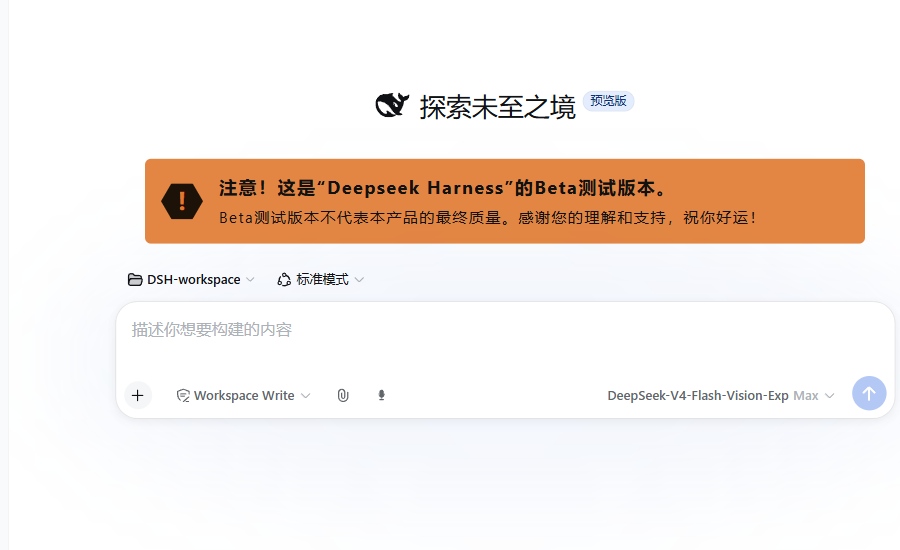
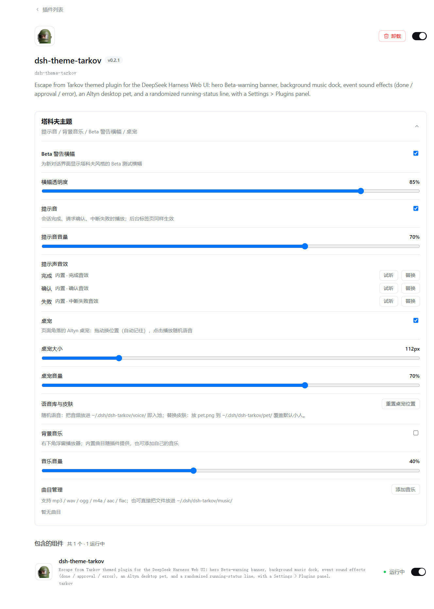
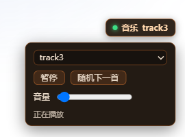
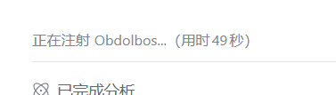

# dsh-theme-tarkov


以《逃离塔科夫》（Escape from Tarkov）主界面为灵感的 DeepSeek Harness（DSH）Web 界面主题插件：Beta 警告横幅、提示音、背景音乐、Altyn 桌宠，以及状态行文本。

> 本插件仅以游戏风格为灵感，界面元素均为 CSS / SVG / 代码实现；背景音乐默认不随包分发，由用户自行提供（见下文「文件放在哪里」）。

> **0.2.2 已适配 DSH 0.1.7-rc.2**：设置卡片迁到官方 slot `plugins.bundle.config`（并默认展开）、状态行文案随官方键名迁移（`chat.deepDiving` → `message.turnProcess.deepDivingFor`，换句时保留耗时）、插件页「已安装」列表新增本插件图标。旧版本（≤0.1.6）的两条路径仍然保留，同一个包可同时兼容。

## 界面截图

| | |
| --- | --- |
|  | 新对话界面的 Beta 警告横幅，文案与透明度均可在设置中调整 |
|  | 插件页 → dsh-theme-tarkov：默认展开的「塔科夫主题」配置卡片 |
|  | 右下角 BGM 浮窗|
|  | Altyn 桌宠，点击发出随机语音，可拖动 |
|  | 状态行随机文案 |

## 功能

- **Beta 警告横幅**：为新对话界面添加塔科夫风格的 Beta 测试横幅，文案与透明度可在设置中调整。
- **提示音**：会话完成、请求确认、中断失败时播放对应音效；后台标签页也会响；三种场景都可以换成你自己的音频。
- **背景音乐**：右下角浮窗播放器，曲库由你自己提供（目录放置或面板上传）；多个标签页同时打开时，只有 leader 标签页在播放。
- **Altyn 桌宠**：角落里的 Altyn 头盔小人——拖动换位置（自动记住）、**点击播放随机 Scav 语音**（包内 47 条）；把自备音频放进语音目录可加入随机池。
- **状态行随机文案**：运行中的「深度求索中」换成塔科夫风台词（如「正在寻找加密 U 盘...」），**每完成一步**（一次思考、一次工具调用）随机换一句；用时不会丢（0.1.7 起官方把耗时并进同一句，本插件换句时自动保留/注入，可在池文件里用 `{duration}` 自定义位置）。
- **窄屏（手机竖屏，≤768px）适配**：桌宠自动隐藏**且不再下载皮肤图**；Beta 横幅字号降到 14 / 12px，图标与内边距同步收紧，**两段文本各自硬限两行**（`line-clamp`，文案再长也不会撑破布局）；≤380px 再降一档 13 / 11px。桌面视口（≥769px）完全不受影响。
- **设置面板**：插件页 → dsh-theme-tarkov →「塔科夫主题」（**默认展开**），开启/关闭各功能、调整音量与横幅透明度、管理音乐曲库（添加 / 删除 / 禁用）。
- **插件列表图标**：插件页「已安装」列表里本插件行左侧显示 Altyn 头盔图标（`package.json` 的 `icon` → `assets/icon.png`，由 DSH 读成 data URL；规则见下）。

## 安装

> **方式一（推荐）：npm 一键安装**

```bash
dsh plugin --profile web add dsh-theme-tarkov
```

> **方式二：git clone + link 安装**

```bash
git clone https://github.com/ZHIGENGNIAO258/dsh-theme-tarkov.git
dsh plugin --profile web add link:<绝对路径>   # 把 <绝对路径> 换成上面的克隆目录
```

`dsh plugin add` 会把本包加入 `~/.dsh/profiles/web/package.json` 的 `dsh.profile.bundles`，bundle 层**自动应用**包内 `cordis.patch.yml`（即插件行 `id: tarkov`）。重启 dsh web 即生效。

- **npm 安装**：无需保留任何目录；升级运行 `dsh plugin --profile web update dsh-theme-tarkov` 后重启 dsh web。
- **link 安装**：**请保留克隆目录不要删除**——profile 通过软链接引用它；升级只需 `git pull` 再重启 dsh web。

> 提示：包刚发布后 24 小时内安装可能被 DSH web profile 的「最低发布年龄」策略（`minimumReleaseAge: 24h`）拦截；稍等重试，或把 `dsh-theme-tarkov` 加入 profile `pnpm-workspace.yaml` 的 `minimumReleaseAgeExclude`。

## 配置：文件放在哪里

| 位置 | 内容 |
| --- | --- |
| `~/.dsh/dsh-tarkov/music/` | 背景音乐：**直接把音频文件丢进去即可**（mp3 / wav / ogg / m4a / aac / flac），或在设置面板点「添加音乐」上传（上限 200MB） |
| `~/.dsh/dsh-tarkov/sounds/` | 提示音：内置音效（done.m4a / approval.m4a / error.m4a）由插件直接伺服，**不需要复制**；想换音效就放一个同名文件（任意音频格式）到这里，或用设置面板上传 |
| `~/.dsh/dsh-tarkov/voice/` | 桌宠随机语音：**把音频文件丢进去即可**（mp3 / wav / ogg / m4a / aac / flac），与包内语音一起进随机池；包内无语音时不放文件也能玩 |
| `assets/pet/voice/`（包内） | **内置 361 条 Scav 语音**（mp3，44.1kHz 单声道 CBR 64kbps、合计约 5.4MB，随 npm 包分发 |
| `assets/status/texts.zh.txt`（包内） | **状态行随机文案池**（中文）：一行一句，`#` 开头的行与空行忽略，重复行只取第一条；每完成一步随机换一句。句子里可以写 `{duration}` 占位符（如「正在搜刮战利品 {duration}」），不写则自动在句尾补上用时（中文「（用时12秒）」/ 英文「(12s)」），所以随机换句**不会遮掉运行时长**。`texts.en.txt` 是英文池，缺失时英文界面回落到中文池。改完刷新页面即可，无需重启 |
| `~/.dsh/dsh-tarkov/pet/` | 桌宠自定义皮肤：放一张 `pet.png`（也可 gif / webp / jpg）覆盖默认的 Altyn 小人。 |
| `~/.dsh/dsh-tarkov/prefs.json` | 全部设置（音量、透明度、开关、禁用曲目等） |

安装后打开插件页 → dsh-theme-tarkov →「塔科夫主题」配置卡片，即可开启/关闭各功能、调整音量和横幅透明度、管理曲库。

## 技术实现（维护参考）

### Host 半区（`src/index.js` → esbuild 打包为自包含 `lib/index.js`）

- `/dsh-tarkov/prefs`：设置的读写；PUT 按字段合并，浏览器端自定义提示音以 dataURL 存储（单文件上限 2MB）。
- `/dsh-tarkov/sfx-poll` + `/dsh-tarkov/sfx`：提示音队列与音频服务；`classifySessionEvent` / `createSfxState` 完成事件分类与去重（`approval/asked → decided` 配对，只响一次；子代理会话不触发）。
- 曲目库：`assets/music`（包内可选内置目录，**默认不含歌曲**——构建者放入音频即成为"内置曲目"，适合自定义发行）+ `~/.dsh/dsh-tarkov/music`（用户）按**文件名（不含扩展名）**合并，同名用户文件优先，内置曲目标记 `builtin`。
- `/dsh-tarkov/music`（曲目列表）、`/dsh-tarkov/music/add`（原始字节流式上传）、`/dsh-tarkov/music/delete`（用户文件删除磁盘文件；内置曲目写入 `music.removed` 从列表移除，可通过恢复按钮清除）、`/dsh-tarkov/audio`（流式播放）。
- 桌宠（`pet` prefs 组）：`/dsh-tarkov/pet/voice`（随机语音库列表 = 包内 `assets/pet/voice` 全部音频 + `~/.dsh/dsh-tarkov/voice/` 用户文件，**都由路由直接伺服、不复制**）、`/dsh-tarkov/pet/audio?id=&kind=`（`kind=builtin` 走包内目录，`kind=user` 走 voice 目录；id 防穿越 + 扩展名白名单）、`/dsh-tarkov/pet/image`（自定义 `pet.png` 优先，否则回退包内 `assets/pet/altyn.png`）。全部随 `pet.enabled` 门控。
- `/dsh-tarkov/status-texts`：状态行文案池，**每次请求现读** `assets/status/texts.<lang>.txt`（改文件只需刷新页面，不重启）；`parseStatusTexts` 做 trim / 去注释 / 去重 / 长度与条数上限，池全空时返回 `enabled: false`，浏览器端据此保持原生文案。
- `/dsh-tarkov/status-poll`：状态行节奏计数器——非子代理会话的每个 `step/end` 让 `statusSeq` +1，浏览器端轮询它，序号一动就换一句（client 侧没有会话事件流，计数只能放在 host）。
- 插件列表图标（`package.json` 的 `icon`）不经过任何插件路由：DSH 的 `readPluginMeta` 直接读包内文件并转 data URL，所以插件半区无需为它注册端点。
- 设置页策略：≤0.1.6 注册 settings 命名空间（空 schema）使浏览器卡片出现在「插件配置」页；0.1.7 起该命名空间注册表已移除（服务只剩实例级页面策略），改为 `configure({ auto: false }, ctx.fiber)` 声明「本插件自带页面」，卡片则改由 Client 侧注册 `plugins.bundle.config`。两条路径用 `typeof … === 'function'` 特性探测并存，旧版行不受影响。

### Client 半区（`lib/client.js`，直接编辑，无需打包）

- 横幅：MutationObserver 观察 hero 选项行（`[class*='_heroWorkspaceRow']`）后注入；**写 DOM 前先比较值**——无条件的 `textContent` 赋值会对稳定的字符串产生 childList mutation 记录，形成「赋值 → mutation → 再赋值」的自反馈死循环（曾导致页面卡在 "Loading plugins…"）。
- BGM：多标签页通过 localStorage 心跳（12s 超时）选举唯一 leader，BroadcastChannel 转发控制命令；被禁用的曲目从播放列表过滤，若正在播放会立即停止。
- 桌宠：`body` 直挂 + MutationObserver 守灵（dsh 首屏 React 会清 body 直挂节点）；指针交互三件套——`setPointerCapture`（绑自身，勿绑祖先）+ 6px 位移阈值区分点击/拖动 + `pointercancel`/`lostpointercapture` 清理；位置存 localStorage（恢复时钳位到当前视口，防大屏位置不可达）；点击 = `<350ms` 且未移动，随机语音经 Web Audio 解码播放（buffer 按 id 缓存，上限 12 条）；右键菜单行在 root 内，pointerdown 对菜单区域 return，否则 setPointerCapture 会把菜单点击截胡成戳。
- 状态行：包装 `locale.translate`，拦下 `chat` 命名空间的**两个运行文案键**——`chat.deepDiving`（0.1.7 起只用于无障碍播报的隐藏节点）与 `message.turnProcess.deepDivingFor`（0.1.7 起用户实际看到的运行文案，带本地化的 `{duration}` 参数），都返回池中随机句。之所以要包装：**公开 locale API 覆盖不了内置文案**（同命名空间+同语言二次注册会抛 `locale namespace "chat" already has locale "zh"`），包装实例方法才能同时命中 ui-chat 自己的 `t` 和 slot 注入的 `t` 席位。`{duration}` 按上表规则注入，播报键不带时长、因此返回裸句，同一轮内两条路径文案一致。换句由三路只读信号共同驱动、合并进同一个 `reshuffle` 标志：① `[role="status"][aria-live]` 新增节点（新一轮开始）；② 状态行的**兄弟节点**新增（消息流又渲染了一步，不依赖 host，旧 host 也能用；0.1.7 起状态行节点嵌在 turn-process 内部，这一路语义弱化，仅作辅助）；③ 轮询 `/dsh-tarkov/status-poll`（host 的 `step/end` 计数，主信号，覆盖纯思考阶段）。全程不写 DOM，不碰耗时显示。locale 服务经 `ctx.inject(['locale'], …)` 作为**可选依赖**获取，缺失时静默不接管，不影响横幅/音乐/桌宠。
- 设置卡片：注册 `plugins.bundle.config`（**key = npm 包名 `dsh-theme-tarkov`**），卡片渲染在该 bundle 页的 `view: 'page'` 位置（`view: 'summary'` 返回 null，列表一行说明由包描述承担）。卡片**默认展开**（这页就是本插件专属的配置面，折叠等于把全部控件藏起来）。0.1.7 之前该席位不存在，旧行的卡片走 host 命名空间 + `settings.plugin.item`。卡片外壳与字段样式复刻原生 PluginCard / fields 的 CSS token（`--dsw-alias-*`），根元素是普通 `div`（不再假设自己在 `<ul>` 列表里）。
- 插件列表图标：由 `package.json` 的 **`icon`** 字段声明，DSH 的 `readPluginMeta`（`dsh-app-boot`，`ctx.pluginPackages.metaOf`）把它读成 data URL 交给插件页渲染。硬规则（违反则**静默回退默认图标**并附诊断）：必须是**相对路径**（绝对路径/URL 前缀直接抛错）、扩展名限 **svg / png / jpg / jpeg / webp**、**原始字节 ≤ 256 KiB**、realpath 后仍留在 package.json 所在目录内。本插件的 `assets/icon.png`（256×256、137.5 KiB）由 `assets/pet/altyn.png` 居中裁切头部生成，所以**换桌宠皮肤不会换图标**（图标是独立资产）。`metaOf` 每次调用都重新读盘，**改图标刷新页面即可，无需重启**。
- 窄屏适配：断点沿用 BGM 浮窗已有的 `@media (max-width:768px)`。横幅的两行用 `display:-webkit-box` + `-webkit-line-clamp:2`（同时写标准 `line-clamp`）**硬保证**，而不是靠字号精算——实测 408px 视口下文本列只有约 256px，浏览器还可能做 5%~15% 的字体放大。桌宠是「CSS 隐藏」**加**「`matchMedia` 门控」（`syncPetFromPrefs()` 在窄屏直接 `destroyPetUi()` 不建 DOM）：只写 CSS 的话窄屏仍会下载 331KB 的 altyn.png，`resize` 还会把记忆坐标按窄视口重新钳位、回到大屏时位置被改小。

### 测试

- `tests/notify.test.mjs`：事件分类、去重状态机、prefs 校验；
- `tests/host-routes.test.mjs`：host 路由集成测试（隔离 DSH_HOME，不碰真实数据）——曲库合并、添加/删除、流式播放、桌宠语音库合并/播放/防穿越/皮肤回退、pet prefs 校验；
- `tests/status-texts.test.mjs`：文案池解析（注释/空行/去重/上限）、client 包装（步内稳定、步进换句、兄弟节点换句、可见键与 `{duration}` 注入、语言回落、透传、dispose 还原）、host 路由内容、`step/end` 计数（子代理不计）、0.1.7 settings 页面策略（`configure({ auto: false })` 恰好一次）；
- `tests/client-smoke.mjs`：client 初始化与 apply() 冒烟；
- `tests/narrow-screen.test.mjs`：窄屏断点与两行 clamp 的 CSS 断言，以及「窄屏不构建桌宠（不请求 altyn.png）、宽屏照旧」的门控断言。

## 开发

```bash
pnpm install          # 安装 esbuild / @deepseek-ai/schemastery（dev 依赖）
pnpm run build        # 打包 src/index.js → lib/index.js（内联第三方依赖为自包含产物）
node --check lib/index.js && node --check lib/client.js   # 语法检查
node tests/notify.test.mjs && node tests/host-routes.test.mjs && node tests/status-texts.test.mjs && node tests/client-smoke.mjs && node tests/narrow-screen.test.mjs
```

本地开发直接用上面的「安装」link 方式（clone 后改代码，重启 dsh web 生效）。

### 发版（维护者）

发布已启用 npmjs **Trusted Publishing**（GitHub Actions OIDC，无需 npm token，见 `.github/workflows/npm-publish.yml`，推送 `v*` 标签自动构建、测试并发布，自动生成 provenance）：

```bash
npm version patch -m "release v%s" && git push --follow-tags
```

注意：

- Host 源码在 `src/index.js`，改动后必须 `pnpm run build` 再重启 dsh web；
- Client 半区直接改 `lib/client.js`（`__ModuleLoader__` 格式即运行时契约，无需打包）；
- link 安装的插件 Host 半区**无法解析第三方包**（Node 按 realpath 解析），所以产物必须由 esbuild 内联为自包含。

## 已知限制

- 横幅锚定 hero 选项行的 hash 类名（`[class*='_heroWorkspaceRow']`），Web UI 结构重大重构时需随版本维护。
- 320px 级超窄屏下，横幅两段文本仍会以省略号收尾——这是 `line-clamp` 的预期行为，「两行以内」优先于「完整显示」；340px 及以上实测都能完整排进两行。
- 状态行文案依赖 DSH 内部的 `locale.translate` 实例方法、运行文案的 locale 键名（`chat.deepDiving` / `message.turnProcess.deepDivingFor`）、`[role="status"][aria-live]` 节点形状与 `step/end` 会话事件：拿不到这些形状时插件静默不接管（显示原生文案），DSH 大版本升级后需复核。**0.1.7 就发生过一次**：可见运行文案从 `chat.deepDiving` 换成带 `{duration}` 的 `message.turnProcess.deepDivingFor`，只拦旧键会让随机文案"消失"。
- 设置卡片位置依赖官方 slot `plugins.bundle.config`（0.1.7 起）与 profile 里 bundle 的包名；旧行（≤0.1.6）该席位不存在，卡片只在「插件配置」页出现。
- 插件列表图标是**独立于桌宠皮肤**的资产（`assets/icon.png`，从 altyn.png 裁头生成）：换 `pet.png` 只会影响桌宠与卡片外观，不影响列表图标；`package.json.icon` 若违反大小/格式规则，插件页会静默回退默认图标（不会报错打扰用户）。
- 状态行换句的第②路 DOM 信号（状态行兄弟节点新增）在 0.1.7 结构下语义弱化，主信号是 host 的 `step/end` 计数，host 不可用时才依赖它。

## 卸载

```bash
dsh plugin --profile web remove dsh-theme-tarkov
```

`dsh plugin rm/remove` 会从 profile 的 `dsh.profile.bundles` 移除本包，包内 `cordis.patch.yml` 由 bundle 层自动应用并随之卸载，无需手动清理。link 方式安装的克隆目录可一并删除。

## License

MIT
